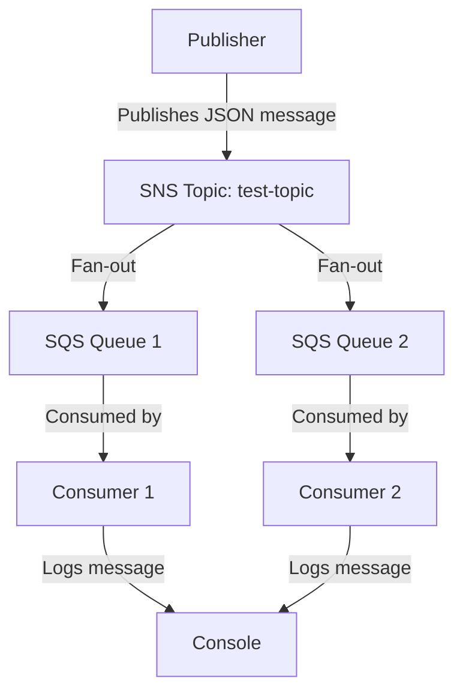

# AWS SNS + SQS Playground (Go, Localstack)

This project demonstrates a minimal publisher and multiple consumers communicating via AWS SNS + SQS using Localstack, all orchestrated with Docker Compose and Go.

## Features
- Publisher sends a hardcoded JSON message to an SNS topic.
- Two SQS queues are subscribed to the topic.
- Two consumers each listen to their queue and log received messages.
- All AWS resources are provisioned automatically via Localstack init hooks.
- All setup and execution is managed via `make dev`.

## Prerequisites
- [Docker](https://www.docker.com/)
- [Docker Compose](https://docs.docker.com/compose/)
- [Make](https://www.gnu.org/software/make/)

## Project Structure
- `cmd/publisher/main.go` — Publishes a message to SNS.
- `cmd/consumer/main.go` — Consumes messages from a queue (used by both consumers).
- `scripts/setup_localstack.sh` — Provisions SNS topic and SQS queues in Localstack.
- `build/Dockerfile.localstack` — Custom Localstack image with init script.
- `docker-compose.yml` — Orchestrates all services.
- `Makefile` — Encapsulates all setup and run commands.

## Setup & Usage

1. **Clone the repository**

2. **Copy and edit environment variables:**
   ```sh
   cp .env.example .env
   # (Edit .env if needed, but defaults work for Localstack)
   ```

3. **Start the full stack:**
   ```sh
   make dev
   ```
   This will:
   - Build all Docker images (including a custom Localstack image)
   - Start Localstack and provision SNS + SQS
   - Start two consumers (each listening to their SQS queue)
   - Run the publisher once (publishes a message to SNS)

4. **Check logs:**
   ```sh
   docker compose logs consumer1
   docker compose logs consumer2
   docker compose logs publisher
   ```
   You should see both consumers log the same message:
   ```
   [Consumer test-queue-1] Received: {ID:1 Body:Hello from publisher!}
   [Consumer test-queue-2] Received: {ID:1 Body:Hello from publisher!}
   ```

5. **Clean up:**
   ```sh
   make clean
   ```

## Notes
- The SNS topic and SQS queues are created automatically by the init script in Localstack.
- The consumers will keep running and listening for new messages.
- To send another message, restart the publisher:
  ```sh
  docker compose restart publisher
  ```

## Troubleshooting
- If you change the Go code, re-run `make dev` to rebuild containers.
- If resources are not created, ensure the init script is in `/etc/localstack/init/ready.d/` and is executable.
- For more details, check the logs of the Localstack container:
  ```sh
  docker compose logs localstack
  ```

---

## Code Explanation

### Publisher (`cmd/publisher/main.go`)

- **Config Loading:**
  - Uses `config.GetAWSRegion()` and `config.GetAWSEndpoint()` to load AWS region and endpoint from `.env` (via a shared helper in `internal/config`).
- **AWS Session:**
  - Creates an AWS session using the loaded config values.
- **SNS Topic Creation:**
  - Calls `CreateTopic` for `test-topic` (idempotent, returns ARN).
- **Message Construction:**
  - Defines a `Message` struct with `ID` and `Body` fields.
  - Marshals a hardcoded message (`{"id": "1", "body": "Hello from publisher!"}`) to JSON.
- **Publish:**
  - Publishes the JSON message to the SNS topic using the ARN.
- **Output:**
  - Prints confirmation to the console.

### Consumer (`cmd/consumer/main.go`)

- **Config Loading:**
  - Uses `config.GetAWSRegion()`, `config.GetAWSEndpoint()`, and `config.GetQueueName()` to load AWS region, endpoint, and queue name from `.env` (via a shared helper in `internal/config`).
- **AWS Session:**
  - Creates an AWS session using the loaded config values.
- **Queue URL:**
  - Looks up the SQS queue URL by name.
- **Polling Loop:**
  - Continuously polls the queue for messages.
- **SNS-to-SQS Envelope Handling:**
  - Each SQS message body is a JSON envelope from SNS, with the actual message in the `Message` field.
  - The consumer first unmarshals the envelope, then unmarshals the inner message into the `Message` struct.
- **Logging:**
  - Logs the raw SQS message body and the parsed message to the console.
- **Cleanup:**
  - Deletes each message from the queue after processing.

---

## System Flow Diagram



---

**Enjoy experimenting with AWS SNS + SQS locally!**
